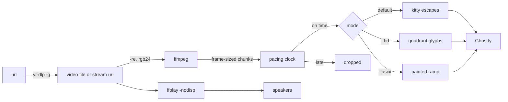

```
      ██╗ █████╗ ███████╗███████╗
      ██║██╔══██╗╚══███╔╝╚══███╔╝
      ██║███████║  ███╔╝   ███╔╝
 ██   ██║██╔══██║ ███╔╝   ███╔╝
 ╚█████╔╝██║  ██║███████╗███████╗
  ╚════╝ ╚═╝  ╚═╝╚══════╝╚══════╝
```

<div align="center">

### `A MOVIE IN YOUR TERMINAL // JAZZ IN YOUR EARS`

*a focus-video player for Ghostty — real pixels, quadrant blocks, or painted ascii, depending on how much you want to admit it's a video*

    -555555?style=flat-square&labelColor=111111) 

</div>

---

## 🎷 What is this

A CLI that plays a video inside your terminal while you work — built for one hour of batman-adjacent jazz, generalized to any file you drop in `~/.config/jazz`, and then to any URL you can paste. ffmpeg decodes contrast-normalized RGB frames at playback speed, ffplay handles the audio invisibly, and a single TypeScript file turns each frame into something your terminal can draw. It loops forever, because the video ending is not a problem you should have to solve at minute 61.

There are three fidelity tiers. The default transmits real pixels over the Kitty graphics protocol (Ghostty scales them into the pane). `--hd` packs a 2×2 pixel block into every cell using quadrant characters. `--ascii` is the original vibe: brightness picks a character from a 15-step ramp and the cell gets painted with the pixel's own color. The project started as ascii art and clawed its way up the resolution ladder one complaint at a time.

Pause, seek, and window resizes are all the same trick internally — kill ffmpeg, respawn it at a timestamp — which means the whole player is one loop with no state worth corrupting. A URL slots into that model for free: yt-dlp hands back a direct stream link, ffmpeg opens it exactly like a file, and seeking becomes an http range request nobody had to write code for.

```console
nick@jazz:~$ jazz
[✓] 1 video in ~/.config/jazz — playing batman-jazz.mp4. loop: forever.
[i] space pauses. q quits. arrows seek. the jazz survives all three.

nick@jazz:~$ jazz https://youtube.com/watch?v=...
[✓] yt-dlp resolved it. nothing downloaded. seek still works.
```

## 📽️ The projection booth

| | feature | what it actually does |
|---|---|---|
| 01 | **pixel mode (default)** | what it actually is: base64 RGB frames chunked at 4096 bytes over the kitty graphics protocol, one reused image id so each frame replaces the last. queries your cell size with `CSI 16 t` for correct aspect |
| 02 | **`--hd` quadrants** | what it actually does: splits every cell into 2×2 pixels, picks the quadrant glyph (▘▀▞▟) whose pattern matches the bright/dark split, averages each group into fg/bg — 4× the detail of ascii, still technically text |
| 03 | **`--ascii` painted cells** | what it actually does: maps luminance to a 15-char ramp with a gamma lift for dark scenes, paints the cell background with the dimmed pixel color and the glyph brighter — film noir stays legible |
| 04 | **video library** | what it actually does: bare `jazz` plays the only file in `~/.config/jazz`, or opens an fzf picker when there are several. `jazz <path>` plays anything else |
| 05 | **URLs, no flag** | what it actually does: `yt-dlp -f b/bv*+ba` resolves the page to a direct stream link (muxed if one exists, otherwise separate video and audio), and ffmpeg, ffprobe and ffplay open http exactly like they open a file. nothing downloads, nothing lands in `/tmp`, and seek is a range request. links are signed and expire after a few hours |
| 06 | **controls** | what it actually does: space pause/resume, ←/→ seek ±10s (presses stack), q quit — every one implemented as "respawn ffmpeg at a timestamp" |
| 07 | **resize handling** | what it actually does: catches SIGWINCH, re-measures the grid, refits, continues where it was. no relaunch |
| 08 | **sync strategy** | what it actually does: ffmpeg decodes with `-re` at playback speed, frames pace against a first-frame wall clock, anything more than one frame late is dropped — audio never waits for video |

## 🚀 Run it

Needs [bun](https://bun.sh), ffmpeg (`brew install ffmpeg` — brings ffprobe and ffplay), a Kitty-graphics terminal for the default mode (Ghostty, kitty, WezTerm), fzf if your library grows past one file, and yt-dlp if you want to pass a URL.

```bash
git clone https://github.com/nitrimandylis/jazz.git
cd jazz
bun run compile          # → ~/.bun/bin/jazz, man jazz, and the agent skill
mv your-video.mp4 ~/.config/jazz/
jazz                     # the library (fzf picker if there's more than one)
jazz ~/Movies/heat.mkv   # any file
jazz https://youtu.be/…  # any URL yt-dlp knows, which is most of them
jazz --ascii https://…   # flags compose with all three
man jazz                 # modes, keys, and JAZZ_LOG, offline
```

The binary embeds the bun runtime, so the repo can disappear afterwards and `jazz` will not notice (recompile after editing `jazz.ts` — it's a snapshot, not a symlink).

## 🤖 The agent skill

`jazz-cli/SKILL.md` is an agent skill for driving `jazz` — chiefly that `jazz` puts stdin in raw mode at startup, so every invocation including `--help` dies without a TTY and nothing should try to spawn it. The traps that don't fit in
`--help`, in other words. `bun run compile` copies it into `~/.claude/skills/`.

It's a plain directory at the repo root rather than a `.claude/` one, because this repo is public and
not everyone drives it with the same agent. Point yours at the file.

## 🔩 Under the hood



| layer | path | job |
|---|---|---|
| the whole player | `jazz.ts` | one file: library/fzf, url resolution, ffmpeg + ffplay lifecycle, three renderers, pacing, keys, resize |
| the checks | `jazz.test.ts` | 12 bun tests — fitting math, ramp mapping, quadrant splitting, kitty chunking, yt-dlp parsing, a real ffmpeg pipe |
| the library | `~/.config/jazz/` | your videos live here, not in the repo |
| debug tap | `JAZZ_LOG=/tmp/j.log jazz` | timing lines per second: frames, lateness, buffer, rss |

**Stack:** bun · typescript · ffmpeg/ffplay · kitty graphics protocol · fzf · yt-dlp

---

<div align="center">

**[Nick Trimandylis](https://github.com/nitrimandylis)**

`TWELVE FRAMES PER SECOND IS ENOUGH FOR ANYBODY`

</div>
